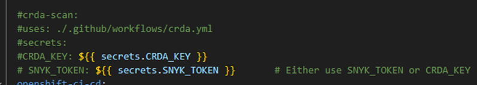

# Ministry Name Tracking App
##### This app was made as a minimum viable product (MVP) to track ministry name and acronym changes. It can also track ministry name history going forward.

---

## Components
* Postgres database 
* Node JS w/ express JS (using ejs and Javascript)

---

## Getting Started
To run locally, you need docker desktop installed and running. 

Create a .env file with the following variables:
* PORT (default to 8080)
* DB_PORT (default to 5432)
* POSTGRES_HOST
* POSTGRES_USER
* POSTGRES_PASSWORD
* POSTGRES_DB

run `docker compose up --build` 
    
---

## File Structure
The entry point is found in the server.js file in root while general app configuration is found in the app.js file. Also contains dockerfile for main app and docker-compose files for running locally.
#### Config
Contains yaml configuration files useful for Openshift deployment. Specifically for creating and populating a postgres database in openshift using init-db-1.yaml for the job and db-config... files for config maps.
#### Controllers
Contains the bulk of the logic. The api folder contains the logic for the api section while the frontEnd folder contains the logic for rendering the front end display including success and error pages. 
#### DB
Contains database connection configuration file and database population sql scripts. The queries.js file contains all of the SQL queries used by the controller files. There is also a dockerfile for a postgres image including the population scripts if needed.
#### Kompose
Contains yml files converted from the docker-compose file. These were not used in the original openshift deployment but are stored here for alternate deployment options.
#### Public
CSS, images, and frontend JS script files for frontend functionality.
#### Routes
Contains routes for api and web app. All routes are then exported to indexRouter.js which mounts the routes to app.js.
        
eg. Route for Acronym api call based on acronym id:

`Domain/route from index.js/route from apiAcronymRouter.js`

`http://localhost:8080/api/acronym/byAcronymID/:id`
#### Utils
Helper functions for repeat logic.
#### Views
All ejs files for front end rendering. 

---

## Deployment to Openshift
#### These deployment steps are for a CI pipeline using a github actions workflow and the github container registry (ghcr.io).  Specifically, it uses the openshit.yml workflow. 

#### Prerequisites
These instructions assume you have oc installed. 
#### Workflow Set-up
In openshift.yml, check that all the env. variables are correct eg. APP_NAME. In github, add the following repository secrets. See [here](https://github.com/redhat-actions/oc-login#readme) for how to retrieve these values.

* OPENSHIFT_SERVER: after `oc login`, run `oc whoami --show-server` to get this value

* OPENSHIFT_TOKEN: after `oc login`, run `oc whoami --show-token` to get this value

* OPENSHIFT_NAMESPACE: the desired namespace 

* TOKEN: github access token used to access ghcr. See [registry docs](https://docs.github.com/en/packages/working-with-a-github-packages-registry/working-with-the-container-registry) for more information.

This workflow is set to run on a push/merge to master branch. Update this if a different trigger is needed.

The CRDA scan section is not configured. If you want to run this vulnerability check, see the [github crda action](https://github.com/redhat-actions/crda/blob/main/README.md) for info on updating this section of the worklow.

